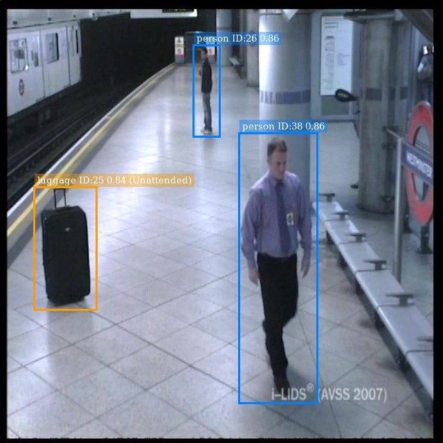
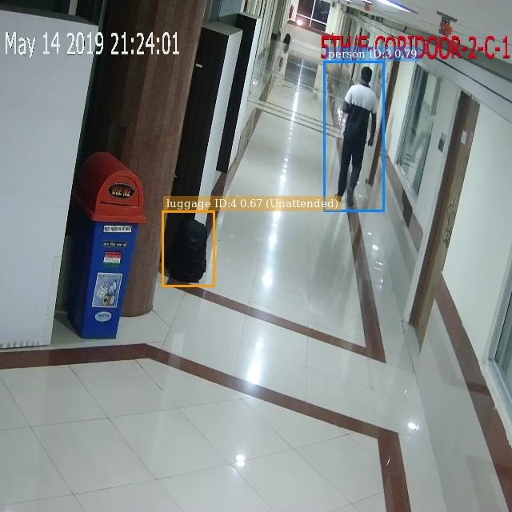
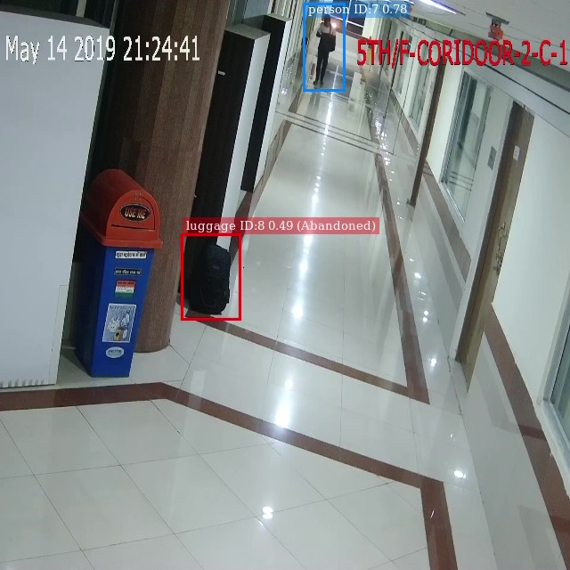

# Embedded System for Suspicious Luggage Detection

This project presents an embedded system for detecting suspicious luggage in
CCTV surveillance footage, deployed on an NVIDIA Jetson Orin Nano. The pipeline
combines a fine-tuned YOLO26s object detection model with DeepSORT tracking and
custom spatio-temporal abandonment logic to identify luggage that has been
separated from its owner beyond a configurable temporal threshold, all running
in real-time through the NVIDIA DeepStream SDK.

A two-phase transfer learning strategy — training on COCO and Open Images
before fine-tuning on the domain-specific ABODA dataset — achieved a detection
mAP@0.5 of 0.859. End-to-end pipeline evaluation yielded an F1-score of 0.774
on in-domain ABODA sequences. The Jetson Orin Nano sustained real-time
processing at 86-90% GPU utilisation without thermal throttling, confirming the
viability of edge deployment for this workload.

## Repository Structure

This repository is organised into two submodules and a documentation directory:

- **[training/](training/)** — Docker-based training and ONNX export pipeline
  using Ultralytics YOLO. See the [training README](training/README.md) for
  setup and usage.
- **[inference/](inference/)** — DeepStream inference pipeline for the Jetson
  Orin Nano, including the abandonment detection logic and evaluation harness.
  See the [inference README](inference/README.md) for setup and usage.
- **[doc/](doc/)** — LaTeX source for the project report.

## Examples

The pipeline tracks each piece of luggage through three states — **attended**,
**unattended**, and **abandoned** — based on its spatial and temporal
relationship with a confirmed owner. The grid below shows the same sequence
transitioning through each state across all three evaluation datasets. Click
any row header to watch the full clip.

|                                                                                                  | Attended                               | Unattended                               | Abandoned                               |
| ------------------------------------------------------------------------------------------------ | -------------------------------------- | ---------------------------------------- | --------------------------------------- |
| [**ABODA**](https://github.com/user-attachments/assets/7787a3e2-3f0c-40a3-b475-4085c115394c)     |   |   |   |
| [**AVSS 2007**](https://github.com/user-attachments/assets/a5be3db0-9406-424f-9150-44c7253e067d) |    |    |    |
| [**IITP20**](./doc/videos/IITP20_example.mp4)                                                    |  |  |  |

### GitHub Video Embeddings

*The IITP20 example is too long to embed in the README as an attachment, but is still available as a [downloadable `.mp4`](./doc/videos/IITP20_example.mp4).*

## License

This project is licensed under the [MIT License](LICENSE).
